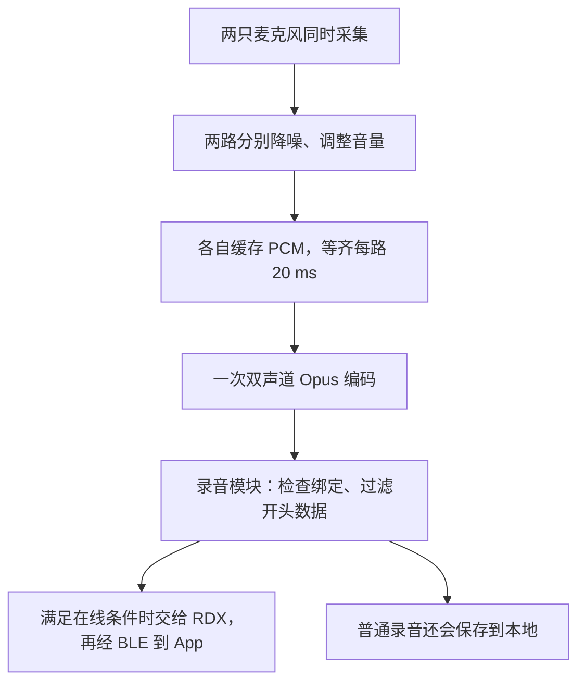
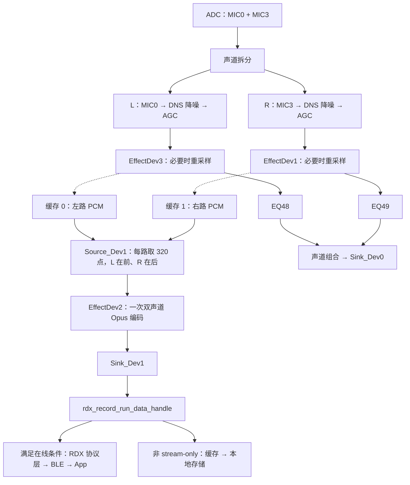
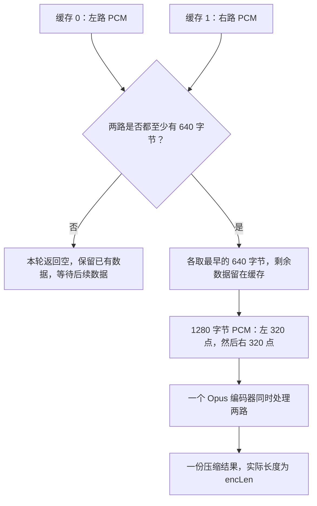
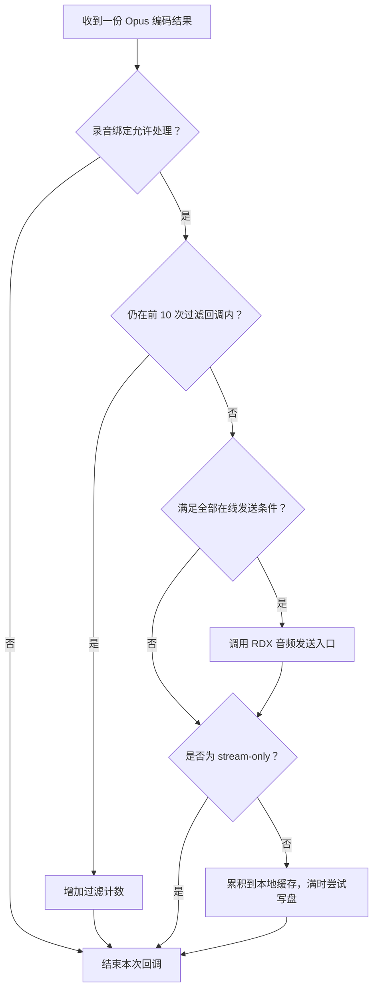

# 会议录音双声道流程：从麦克风到 App

本文面向不熟悉音频开发的读者，依据当前仓库的 C 源码和 JL Studio 音频流程配置，解释会议录音的采集、组帧、编码和发送过程。核对日期：2026-09-17。

后续实现说明：本文描述普通保存录音的双声道基线。会议 stream-only 已增加 2A 固定选路单声道调试路径（默认 MIC0），其适用范围、参数和验收进度见 [9-1 实施方案第 9 节](9-1.会议录音双声道改单声道实施方案.md#9-当前实现验证结果与后续工作)。

**先区分三个概念：MIC 数量是拾音来源的数量，声道数是音频数据的路数，立体感是左右耳听到声音后产生的空间感受。双声道不一定需要两个 MIC，也不一定具有明显的立体效果。**

| 采集与处理方式 | 最终音频 |
| --- | --- |
| 一个 MIC，将同一份数据复制到 L/R | 双声道格式，但两路相同，复制本身不会增加立体感 |
| 两个 MIC，混音或降噪后只输出一路 | 单声道，两个 MIC 不等于双声道 |
| 两个 MIC，各自保留一路并按两路编码 | 双声道，空间效果取决于 MIC 布局和后续处理 |
| 多个 MIC，经过混音、波束成形等处理后输出两路 | 双声道，声道数不必等于 MIC 数量 |

音频也可以由软件直接合成，并不一定来自 MIC。判断单声道还是双声道，要看所讨论环节实际保留、输出了几路数据，不能只数硬件上的 MIC。

对于麦克风录音，不同位置和朝向可能产生到达时间、音量及频谱差异。如果这些空间差异得到保留，并将 L/R 分别送到 TWS 左右耳的 DAC、保持同步播放，就可能听到方向和空间感。但两路数据不同本身不保证良好的立体效果；MIC 布局以及分别降噪、自动调音量等处理都会影响结果。如果两路混成一路再送给两耳，原有的左右差异就无法保留。

**当前会议录音的主线是：MIC0、MIC3 同时采集 → 两路分别降噪和调整音量 → 缓存两路 PCM → 每路取 20 ms → 合成一份双声道输入 → Opus 压缩 → 在线发送，并按录音类型决定是否存储。**

这里的“双声道”指保留两路声音数据，不代表两个人已经被识别、分离，也不代表左右耳各自录一份再通过 TWS 合并。两只麦克风都可能拾取到同一个人的声音；物理朝向和拾音效果需要结合硬件和实测判断。

## 1. 先认识六个词

| 名词 | 通俗解释 | 在本项目中的含义 |
| --- | --- | --- |
| ADC | 把声音的模拟电压变成数字 | 从选中的麦克风通道采集样本 |
| PCM | 尚未压缩的声音数字序列 | 编码入口使用 16 kHz、16 bit 的采样数据 |
| 声道 | 一条独立的声音序列 | 会议录音的两路对应 MIC0、MIC3 |
| 帧 | 切出来的一小段声音 | Opus 每次处理每路 20 ms，即 320 个采样点 |
| 编码 | 按音频算法压缩数据 | 双声道 Opus 编码，目标总码率 32 kbit/s |
| 协议包 | 为传输组织的数据 | RDX 协议层组织后交给 BLE；与 PCM 帧不是同一个概念 |

可以把两路 PCM 想成两条连续纸带。采集不断往纸带上写数字；组帧每次从两条纸带上各剪下一样长的一段；编码器把这两段一起压缩；通信层再负责运送。

“采样率”和“码率”尤其容易混淆：16 kHz 是**每路每秒采集 16000 个点**；32 kbit/s 是**编码后两路合计的目标数据量**。

## 2. 先看声音走过的路

初次阅读先看简图，再按第 4～8 节理解每个环节。需要对照代码时，再阅读第 9 节的历史命名和第 10 节的启停任务。



图中的分支表示数据有两种去向；发送判断和存储处理在同一个录音回调中先后执行。

### 2.1 对照代码的完整流程图

下图展开的是当前会议路径。音频框架节点之间的连接来自 `翻译耳机_单声道.x6flow`；从 EffectDev 节点进入缓存的连接来自 C 源码，用虚线表示。



注意两个出口的区别：

- `Sink_Dev0` 是采集流程的末端，目前 `sink_dev0_run()` 没有实际数据处理。
- `Sink_Dev1` 才是编码结果的出口，调用录音模块进行发送、存储。

图中的 EQ 在缓存取数点之后。因此，按当前连接顺序，送进 Opus 的数据经过了前面的 DNS、AGC，但**没有经过后面的 EQ48/EQ49**。不能把流程图中所有音效都算到最终编码数据上。

## 3. “组包”要分清三个层次

平时说“把两路声音组包发出去”，实际上跨过了三个不同层次：

| 层次 | 输入 → 输出 | 当前能确认什么 |
| --- | --- | --- |
| PCM 组帧 | 两路连续样本 → 一份双声道 PCM 帧 | 每路取 640 字节，左路在前、右路在后，共 1280 字节 |
| Opus 编码 | 双声道 PCM 帧 → 一份压缩结果 | 一个编码器同时处理两路，输出长度以 `encLen` 为准，按目标码率估算约 80 字节 |
| RDX / BLE 传输组织 | 编码结果 → 协议数据，经蓝牙送达 App | 可见音频入口和 BLE 出口；库内包头、分片及帧边界规则需要另外核对 |

**1280 字节是编码前的 PCM 帧大小；约 80 字节是编码结果的估算大小；它们都不能直接当作 BLE 包长。** 音频帧与 BLE 包的数量关系也不能由这两个数字推出。

App 接收后，需要先按协议还原音频帧边界，再交给匹配的 Opus 解码器，才能得到两路 PCM。本文用于理解固件数据流，完整的 App 解包实现还需要协议资料。

## 4. 采集：两只麦克风怎样变成两条数字序列？

### 4.1 选择 MIC0 和 MIC3

会议流程 ADC 节点的通道配置为 `[1, 8]`，对应通道掩码 `BIT(0)` 与 `BIT(3)`。录音模块的会议增益设置也分别操作 `RECORD_MIC_0`、`RECORD_MIC_3`，两处相互印证。

`adc_file.c` 中的 `audio_mic_data_align()` 按麦克风编号整理所选通道。结合流程中声道拆分节点的 L/R 端口连接，当前映射为：

| 物理通道 | 拆分端口 | 处理节点 | 缓存下标 | 最终编码输入 |
| --- | --- | --- | --- | --- |
| MIC0 | L | DNS2 → AGC2 → EffectDev3 | 0 | `pcm_l` |
| MIC3 | R | DNS4 → AGC4 → EffectDev1 | 1 | `pcm_r` |

这里的 L/R 是软件通道顺序；不能仅凭它推断麦克风在外壳左边还是右边。

### 4.2 先交错采集，再按声道拆开

ADC 整理后的两路样本可以示意为：

```text
MIC0[0], MIC3[0], MIC0[1], MIC3[1], MIC0[2], MIC3[2], ...
```

这叫“交错排列”：同一采样时刻的两路数字挨在一起。声道拆分节点把它们拆成各自连续的单声道序列，分别进入两条处理分支。

采集和编码不要求每次回调的长度相同。录音器给 ADC 源设置的中断点数为 256，而 Opus 一帧需要每路 320 点。可以理解为工厂上游每箱装 256 件，下游每箱要 320 件，中间必须有缓存重新凑整。

按 16 kHz 换算，256 点是 16 ms，320 点是 20 ms；不要据此认为一次 ADC 中断会立即产生一个 Opus 帧，音频框架还会做数据块调度和音效帧长适配。

### 4.3 两路各自处理

DNS（Noise Suppressor）用于压低噪声，AGC（Automatic Gain Control）用于自动调整音量。这是节点职责的通俗解释，具体算法内部细节不在这些应用层源码中。

随后：

- `audio_effect_dev3_run()` 将左路写入 `source_dev1_input_write(0, ...)`。
- `audio_effect_dev1_run()` 将右路写入 `source_dev1_input_write(1, ...)`。

两个节点都带有重采样处理：当输入不是目标 16 kHz 时，通过重采样器转换。重采样是改变每秒样本数量，不是 Opus 压缩。会议图中两条分支已经是单声道，`EffectDev1` 中兼容其他场景的多声道转单声道分支，不意味着会议左右两路会在此混成一路。

## 5. 组帧：每路 320 点，左边放完再放右边

### 5.1 两个环形缓存负责“等齐”

`source_dev1_file.c` 定义两个环形缓存 `output_cbuf_h[2]`，分别接收两路 PCM。环形缓存可以理解为一条循环使用的队列：新数据从尾部进入，旧数据从头部取走。

当前宏换算如下：

```text
OPUS_SR     = 16000 Hz
OPUS_FS     = 20 ms
FRAME_POINT = 16000 × 20 / 1000 = 320 点/声道
FRAME_SIZE  = 320 × 2 = 640 字节/声道
每个缓存容量 = FRAME_SIZE × 8 = 5120 字节
```

每路缓存相当于 8 份 20 ms PCM，约 160 ms 的容量。这是缓冲容量，不是固定增加 160 ms 延迟。

### 5.2 两路都够才读

在双声道模式下，`source_dev1_get_packet()` 的规则可以简化为：



图中每次判断对应一次取帧调用；数据不足时先返回，不是在该函数里循环等待。

举例：左路已到 640 字节，右路只有 512 字节，此时不会提前消耗左路，也不会给右路补零。等右路累计到至少 640 字节后，两路一起各取 640 字节，剩余数据留给下一帧。

尽管函数开头有 `memset(output, 0, ...)`，但缺一路时直接返回 `NULL`，所以不能把这段清零理解成“缺失声道自动补静音”。

### 5.3 编码入口使用平面排列

组好的内存是：

```text
字节偏移 0                                            640                                         1280
         | L[0], L[1], ... L[319]                      | R[0], R[1], ... R[319]                    |
         |<------------- 640 字节 ------------------->|<------------- 640 字节 ------------------>|
```

这叫“平面排列”（planar）：先放完左路，再放右路。它与 ADC 阶段的 `L0,R0,L1,R1...` 交错排列不同。

`EffectDev2` 明确按这个格式读取：前 640 字节拷贝到 `pcm_l`，后 640 字节拷贝到 `pcm_r`。把交错数据误当成平面数据送入，会破坏声道内容和时间顺序。

## 6. 编码：一个编码器，一次处理两路

`effect_dev2_node.c` 通过 `get_opus_stenc_ops()` 使用 `lib_opus_stenc.a`，初始化的关键参数如下：

| 参数 | 当前会议双声道值 | 含义 |
| --- | --- | --- |
| `sr` | 16000 | 每路采样率 |
| `nch` | 2 | 一个编码器处理两个声道 |
| `frame_ms` | 20 | 每次处理的音频时长 |
| `br` | 32000 bit/s | 两路合计目标码率 |
| `complexity` | 1 | 编码复杂度配置 |
| `format_mode` | 0 | SDK 接口称“百度无头”，不是 Ogg 封装 |

总码率来自实际公式：

```text
br = OPUS_SR × 声道数 × sizeof(s16) ÷ OPUS_CR × 8
   = 16000 × 2 × 2 ÷ 16 × 8
   = 32000 bit/s
```

每帧调用一次：

```c
opus_stenc->run_wb(run_buf, pcm_l, pcm_r, outdata, &encLen);
```

所以当前做法不是“左路压缩一包、右路压缩一包，然后拼两个压缩包”。左右 PCM 在同一次调用中进入双声道编码器，得到一份编码结果。

也不要试图把编码输出前半段当左声道、后半段当右声道。`L[320] + R[320]` 描述的是**编码前 PCM 的内存布局**；压缩后的字节必须由匹配的解码器解释。

### 6.1 一秒钟有多少数据？

| 阶段 | 20 ms 音频的数据量 | 每秒数据量 |
| --- | --- | --- |
| 单路 PCM | 640 字节 | 32000 字节 |
| 双路 PCM | 1280 字节 | 64000 字节，即 512 kbit/s |
| 双路 Opus，按目标码率估算 | 约 80 字节 | 约 4000 字节，即 32 kbit/s |

80 字节来自 `32000 × 0.02 ÷ 8`，是码率换算值。运行时代码使用编码器返回的 `encLen` 作为实际输出长度，不能仅凭这个公式承诺所有帧一定是 80 字节。无线传输还要加上协议开销。

### 6.2 为什么不能直接当 WAV 或 Ogg 播？

WAV 通常需要文件头描述采样率、位宽等信息；Ogg Opus 也有容器结构。当前编码器选择 `format_mode=0`，没有在这个节点生成 Ogg 文件。

因此，App 需要按 RDX 协议提取音频数据，再按双方约定处理帧边界及 Opus 格式。给接收到的原始字节改一个 `.wav` 或 `.ogg` 后缀，并不会自动变成可播放文件。

## 7. 发送：音频帧如何离开设备？

### 7.1 先进入录音模块

`Sink_Dev1` 从音频流取出编码结果，调用：

```text
sink_dev1_run()
  → rdx_record_run_data_handle(data, data_len)
```

该函数首先检查录音绑定是否允许，随后过滤最开始的 10 次数据回调。这些回调直接返回，既不进入下面的在线发送，也不进入本地存储。

在每次回调对应 20 ms 编码结果的正常情况下，这相当于过滤约 200 ms 的开头音频。源码以回调次数计数，没有在这里使用一个精确的 200 ms 定时器。

### 7.2 一次编码回调怎样决定发送和保存？



箭头表示录音回调中的执行顺序。调用发送入口后继续判断存储类型，并不等待 App 确认接收；在线条件不满足，也仍会判断是否需要本地保存。

### 7.3 有 BLE 连接还不够

在线发送需要同时满足：

- 连接句柄有效。
- 录音绑定的在线会话仍是当前会话。
- `stream_discont == false`，没有暂停这条流的发送。
- `rdx_ble_server_is_stream_tx_ready()` 返回就绪。

最后一个检查要求当前 RDX 链路的 CCC 已配置，并且 `rdx_stream_tx_ready` 已置位。CCC 可以理解为 App 对特征数据推送的订阅开关。代码在相关状态同步之后还安排了 500 ms 的就绪定时器，因此“刚连上”与“可以发录音”是两个状态。

满足条件后，录音层调用：

```c
rdx_protocol_audio_data_indicate(d, len);
```

这个函数名中的 `indicate` 是 RDX 应用接口命名，不能仅凭名字断定空口一定使用 ATT Indication。

### 7.4 协议层与 BLE 层各做什么？

可以把可见边界画成：

```text
Opus 编码结果
    ↓ rdx_protocol_audio_data_indicate(d, len)
RDX 库：音频协议处理及发送组织
    ↓ RDX BLE 发送入口
rdx_ble_server_send() / rdx_ble_server_send_internal()
    ↓ app_ble_att_send_data(..., ATT_OP_AUTO_READ_CCC)
BLE 协议栈 → 空口 → App
```

当前 Makefile 链接的是 `librdxApp_patched.a`。仓库可见 C 源码能确认音频交给 RDX 的入口、发送状态和最终 BLE 出口，但没有提供 `rdx_protocol_audio_data_indicate()` 的完整 C 实现。

因此，本文不虚构其内部包头、序号、校验、分片格式，也不假定“一份 Opus 输出必定对应一个 BLE 包”。如果要编写 App 解包器，需要另外核对 RDX 协议资料、库实现或抓包结果。本文中的 1280 字节布局是 PCM 组帧格式，不是蓝牙协议格式。

可直接确认的 BLE 出口行为是：

1. 获取当前 RDX owner 的传输快照，检查会话是否仍有效。
2. 检查 BLE ATT 发送缓冲的剩余空间。
3. 通过 RDX 数据特征值句柄 `0x0008` 发送；对应 CCC 句柄为 `0x0009`，特征 UUID 为 `06068D2C-6B97-11EF-B864-0242AC120002`。
4. 缓冲不足或发送失败时记录失败并安排发送重试唤醒；成功时清理相关重试状态。

两路声音通过同一个 RDX 音频传输路径发送，不是左路一个 BLE 连接、右路另一个连接。项目的双 BLE wrapper 用于连接和能力管理，不是音频左右声道分工；HOGP 键盘也不是音频的发送出口。

### 7.5 发送成功不等于 App 已经保存

`app_ble_att_send_data()` 返回成功，只能在此处说明数据被协议栈接受，不能直接证明 App 已解码或保存。`rdx_record_run_data_handle()` 也没有根据 `rdx_protocol_audio_data_indicate()` 返回值做逐帧确认。

发送层可见重试机制，并不等于已证明端到端音频永不丢失。判断录音完整性仍需看协议层行为和实际接收结果。

## 8. 存储：编码数据的另一条出口

在同一个 `rdx_record_run_data_handle()` 中，在线发送判断之后，还有本地存储处理。

- 普通录音：编码结果累积到 `au_buf`，通过 `rdx_uxfile_raw_write()` 写入存储。
- `stream-only` 录音：跳过本地保存，只使用在线流路径。

`AUDIO_SEND_BUF_SIZE = 100 × 80 = 8000` 字节。虽然名字中带 SEND，但这里的 `au_buf` 用途是**本地写盘聚合缓存**，不是“两秒才向 App 发一次”的 BLE 缓存。按 4000 字节/秒估算，它约容纳两秒的编码数据；在线入口则在数据回调中直接调用。

普通录音即使本次不满足在线发送条件，仍可继续执行本地存储分支；不必为了保存而先有 BLE 连接。结束时 `rdx_record_run_exit()` 会尝试写出剩余的 `au_len`。

## 9. 为什么代码里写着 MONO，实际却是双声道？

会议场景在代码中叫 `RECORD_SCENE_CHAT`。`rdx_record_auto_run()` 等会议启动分支投递的模式是 `MIC_TO_MONO_OPUS`，选择的流程也是 `翻译耳机_单声道.x6flow`。

但当前实现已经扩展了这条路径：

1. `rdx_app_config.h` 当前定义 `RDX_SUPPORT_ALGORITHM = 1`。
2. `translation_ear_recoder_open_all_impl()` 收到 `MIC_TO_MONO_OPUS` 后，在该配置下将 `global_ch_mode` 设成 `AUDIO_CH_LR`，也就是两路。
3. 模式枚举仍然决定选择 `PIPELINE_UUID_TRANSLATION_MONO`，但这个流程文件里的采集链已经拆成两路，编码链实际连接的是 `EffectDev2`。
4. `Source_Dev1` 根据 `global_ch_mode` 输出双声道 PCM；`Sink_Dev1` 把 LR 格式向前协商，`EffectDev2` 按协商出的两个声道打开 Opus 编码器。

因此，**这里的 MONO 和“单声道”文件名是沿用的命名，不能用它们判断最终编码声道数。** 同理，`translation_ear_recoder.c` 中针对普通 `NODE_UUID_ENCODER` 设置的 `bit_rate = 16000`，也不是这条会议链实际使用的 Opus 总码率：当前流程使用的是自定义 `EffectDev2`。

还有一个命名陷阱：缓存的注释把 `idx=0` 写成 MIC、`idx=1` 写成 DAC。这套缓存被多个录音场景复用。在当前会议流程中，`idx=1` 的生产者是第二路麦克风分支，并非扬声器播放数据。

## 10. 启停与任务：谁负责按下开关，谁负责搬数据？

启动录音与处理每一帧音频，是两类工作。

```text
按键或 App 录音请求
    → 录音状态处理：会议场景 CHAT，START / RESUME
    → 向 rdx_record_task 投递启动模式和绑定 token
    → translation_ear_recoder_open_all_bound()
    → 建立采集流，以及组帧编码流
    → Sink_Dev1 初始化录音会话
    → 音频回调持续产生、处理数据
```

`g_translation_ear_recoder[0]` 管理采集流，`[1]` 管理收集、编码流。这里“两个流实例”也不等于左右声道各开一个编码器。

`Sink_Dev1` 启动时调用 `rdx_record_run_init()`，并检查麦克风增益。这个节点是会话初始化的实际落点；向任务队列投递 START 并不等于音频已经开始。

停止或暂停请求由录音任务处理，关闭相应音频流；`Sink_Dev1` 结束时进入 `rdx_record_run_exit()` 完成尾部存储等工作。绑定 token 可理解为一次有效录音绑定的“代号”，用来阻止旧的异步请求在绑定已经变化后重新启动音频。

ADC 回调负责把采集数据交给音频框架；Source_Dev1 在数据满足条件时通过 `jlstream_wakeup_thread()` 唤醒流处理；RDX 还有发送 worker。因此不要把“采集 → 编码 → 发送”想成一个中断里同步执行到底的长函数。

## 11. 当前实现限制

以下是异常情况或实现边界，对应当前代码行为；实际是否触发，需要结合日志和设备测试判断。

### 11.1 单路丢数后，没有时间戳纠偏

当前组帧依靠两路 FIFO 的顺序配对，没有在这里用时间戳逐帧校准。如果某路缓存空间不足，`source_input_write()` 会拒绝这次写入并累计 `drop`；生产者没有在这两个 EffectDev 回调中重传该块数据。

因此，这套逻辑能保证“每次交给编码器的两路长度相同”，但在发生单路丢数后，不能据此保证两路仍严格对应同一个物理时间段。

### 11.2 存储缓存跨界修复（2026-09-17）

此前实现跨越 8000 字节边界时会丢弃本次输入的剩余部分。现已统一两条处理分支：循环填满并写出聚合块，将余量留在缓存，停止时刷新尾部。

例如已有 7950 字节，再输入 80 字节：先写满 8000 字节，再保留剩余 30 字节。主机行为测试验证跨界、多块输入、尾部刷新和写失败；RDX 二进制写入与设备存储仍需实机验证。此修复不定义 Opus 帧边界，也不改变文件格式。

### 11.3 传输完整性需要接收端验证

BLE 出口的重试唤醒和协议栈接收成功，不等于 App 已收到并保存全部音频。RDX 库内的排队、分片、重传行为仍需协议资料或抓包确认，详见第 7 节。

## 12. 常见问题与定位方法

| 现象或疑问 | 先看什么 |
| --- | --- |
| 文件名写单声道，实际到底几路？ | 看 `RDX_SUPPORT_ALGORITHM`、`global_ch_mode`，再看 `EffectDev2` 协商日志中的 `in_ch_num/out_ch_num` |
| 左右一路没有声音 | 先检查 MIC0/MIC3、ADC 配置及两路增益，再检查对应 DNS/AGC、EffectDev 写缓存路径 |
| 两路有输入但不出编码结果 | 看两个缓存是否都累计到 640 字节；`source_dev1 stats` 中 `wait`、`remain` 可辅助判断 |
| 左右音频逐渐不对齐 | 检查 `drop=左/右` 是否增长，以及两路生产速率；FIFO 组帧没有时间戳纠偏 |
| 调了 EQ，App 录音没变化 | 当前缓存取数点在 EQ48/EQ49 之前 |
| BLE 已连接但 App 没收到音频 | 检查 RDX 会话、CCC、stream-ready、`stream_discont` 和发送失败日志 |
| 开头缺少约 200 ms | 查看录音数据入口对前 10 次回调的过滤 |
| 能收到字节但播放异常 | 区分 PCM 与 Opus，核对双声道、16 kHz、封装及协议帧边界；不要按 640+640 拆压缩字节 |
| 本地有文件但没有在线声音 | 本地保存和在线发送有不同门槛，应分别检查 |

`source_dev1 stats: frames=... wait=... drop=.../... remain=.../...` 在 Source_Dev1 关闭时打印。其中 `wait` 是取帧时数据不足的计数，不直接等于丢包数；`drop` 是缓存写入失败计数；`remain` 是关闭时两路剩余字节数。

## 13. 对照源码的阅读顺序

建议先看配置图，再沿数据方向看 C 文件。以下链接相对于本文位置，函数名可用于搜索定位。

| 文件 | 建议重点 |
| --- | --- |
| [会议使用的音频流程](../src/音频流程/翻译耳机_单声道.x6flow) | ADC16、拆分端口、两条 DNS/AGC 分支，以及 Source_Dev1 → EffectDev2 → Sink_Dev1 |
| [rdx_app_config.h](../SDK/apps/common/third_party_profile/rdx_protocol/rdx_app_config.h) | `RDX_SUPPORT_ALGORITHM` 和当前 App 选择 |
| [rdx_record.c](../SDK/apps/common/third_party_profile/rdx_protocol/rdx_record.c) | `rdx_record_auto_run`、`rdx_record_task`、`rdx_record_run_data_handle`、`rdx_record_run_exit` |
| [translation_ear_recoder.c](../SDK/audio/interface/recoder/translation_ear_recoder.c) | `translation_ear_recoder_open_all_impl`、`translation_ear_recoder_open_impl`：选择流程与 LR 模式 |
| [adc_file.c](../SDK/audio/framework/plugs/source/adc_file.c) | `audio_mic_data_align`、`adc_mic_output_handler`：采集与通道整理 |
| [effect_dev3_node.c](../SDK/audio/framework/nodes/effect_dev3_node.c) | `audio_effect_dev3_run`：左路写入缓存 0 |
| [effect_dev1_node.c](../SDK/audio/framework/nodes/effect_dev1_node.c) | `audio_effect_dev1_run`：右路写入缓存 1 |
| [source_dev1_file.c](../SDK/audio/framework/plugs/source/source_dev1_file.c) | `source_dev1_input_write`、`source_dev1_get_packet`：等齐两路与平面组帧 |
| [effect_dev2_node.c](../SDK/audio/framework/nodes/effect_dev2_node.c) | `audio_effect_dev2_init`、`audio_effect_dev2_run`：实际 Opus 参数与输入排列 |
| [opus_stenc_api.h](../SDK/audio/st_opus_enc/opus_stenc_api.h) | 采样率、帧长、压缩比宏及 `run_wb` 接口 |
| [sink_dev1_node.c](../SDK/audio/framework/nodes/sink_dev1_node.c) | `sink_dev1_init/run/exit`：编码结果交给录音模块 |
| [rdx_ble_server.c](../SDK/apps/common/third_party_profile/rdx_protocol/rdx_ble_server.c) | `rdx_ble_server_is_stream_tx_ready`、`rdx_ble_server_send_internal`：发送门槛和 BLE 出口 |

本文确认的是当前仓库源代码与配置中的处理路径；没有把预编译算法库内部行为、App 解包实现或设备端实际音质视为已经验证的结果。修改流程后还需要重新生成音频资源并构建、烧录，才能验证设备是否运行了相应配置。
